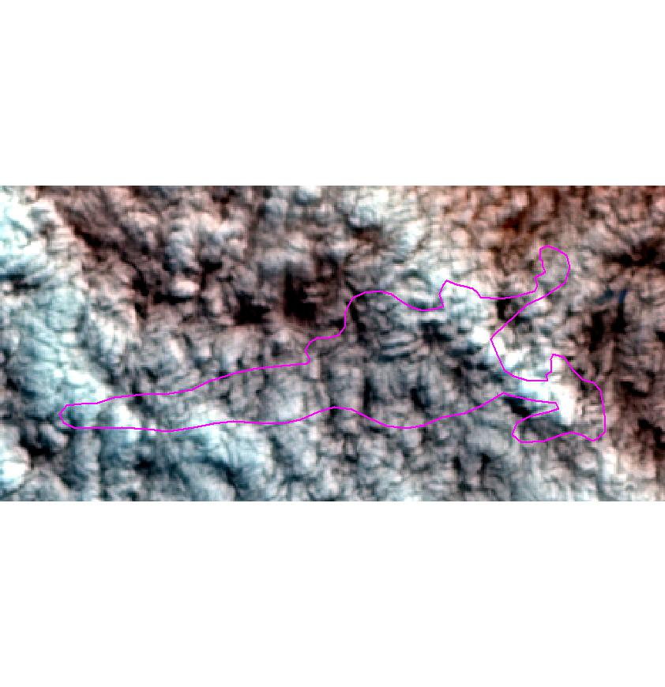
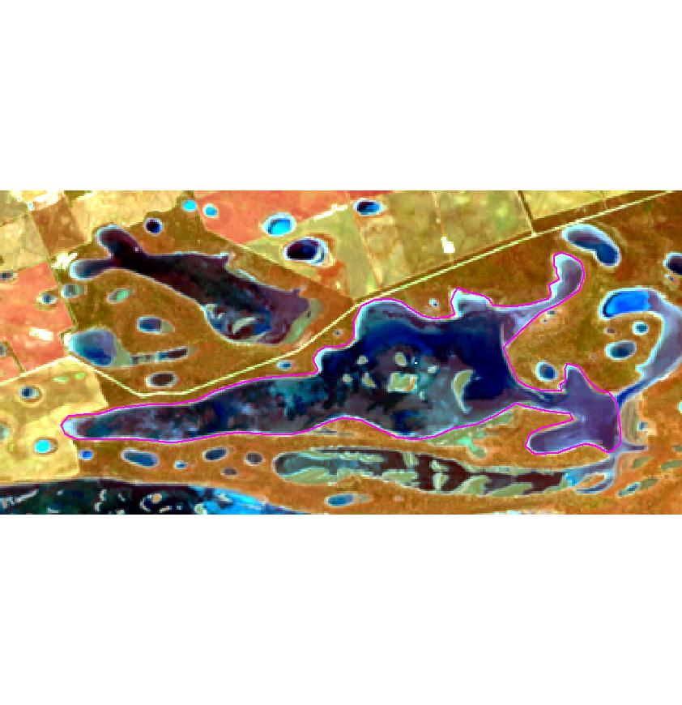

##Introduction
One of the challenges in remote sensing and working with satellite 
imagery is how to deal with clouds and shadows. There are various automated 
routines that exist to aid the researcher such as:

* Using a cloud filter option when downloading the imagery in the first instance.
* Using an automated cloud masking algorithm such as __fmask__ as used by the 
USGS.

Although these tools are very useful they can be a bit "blunt" as an instrument.

One of the benefits of the explosion of availability of satellite data is that 
dense temporal analysis can now be performed. Phenological cycles can now be 
modeled and monitored, for example, and using every suitable image adds more 
certainty to the analysis. In regions where cloud cover often interferes with 
data availability it makes sense to be very accurate with with cloud quality 
assessment. 

This workflow has been designed around a "per site" cloud quality assessment 
protocol. This means that even if an image has been deemed 90% cloud cover, 
through automated assessment by imagery providers, it still may yield usable 
data over a site. This method also allows for a more precise identification of:

* Very thin haze associated with smoke.
* Cloud shadows.
* Clouds in bright environment.

Essentially it consists of the following 3 stages which will yield quality 
assessed time series data for further analysis.

__Stage 1.__ The creation of small jpeg images for each site and date of locally 
stored satellite data.

__Stage 2.__ Rapid visual assessment of created jpegs with deletion of 
unsuitable images.

__Stage 3.__ Extraction of data per site for the dates of images that are left 
after stage 2.

##Stage 1
Firstly start by creating a working directory. This must contain a shape file of 
the sites or locations that ultimately require "clean" data. This directory will
become the repository of all the data that is generated through this workflow.

Next task is to run the `jpegR` function from the __RSSApkg__.
```{r, eval = FALSE}
## Install the RSSApkg if you haven't already
library("devtools")
install_github("Bartesto/RSSApkg")
library("RSSApkg")

## Set up function arguments
# wdir <- path/to/working directory
# imdir <- path/to/imagery directory/pathrow
# layer <- name of shape file that has locations of interest
# attrb <- name of unique id field in shape file
# start <- start image search from this date
# stop <- end image search on this date
# combo <- band numbers to display in RGB
# buffer <- how far to buffer the site location (in metres if imagery is projected to GDA94)

## Run the function
jpegR(wdir, imdir, layer = "my_shape_file", attrb = "siteID", start = "01/12/99", 
      stop = "31-12-2002", combo = c(5,4,2), buffer = 2000)

```

Things to note about the function arguments:

* __wdir__ and __imdir__ are file paths and need to be character strings.
* __layer__ is a character string of the shape file name without the .shp 
extension.
* __attrb__ is the field name of the attribute table that stores the unique ID
for the locations in the shape file. It is a character string.
* __start__ and __end__ are character strings of dates in either ddmmyy or ddmmY
format. It will handle either separator. If you do not provide dates it will 
search the whole archive. Use these date fields to target your search or to do 
annual updates and avoid re-processing the entire archive.
* __combo__ are the bands that will be displayed in the red, green and blue 
channels of the jpeg respectively. In this instance a false colour 542 jpeg will 
be created. Must be a vector of numbers presented this way.
* __buffer__ for GDA94 projected images the numbers represent meters for the 
buffer.

The above example would produce jpeg images for each unique location (as 
designated by id's found in the 'siteID"" column of the attribute table) in a 
shape file called "my_shape_file", for all available satellite data between the 
dates 01/02/1999 - 31/12/2002. These jpegs would be buffered from the location by 
2km and would be a false colour enhancement (542).

For each location a folder will be created in the working directory containing 
all the jpegs. The folders will be named after the unique locations and will 
have the naming convention `jpegs_site_XXX_bbbbbb_eeeeee` where:

* __XXX__ is the unique location id.
* __bbbbbb__ is the first date of imagery processed.
* __eeeeee__ is the last date of imagery processed.

During the process it will also create another folder called `site_vectors`. At 
the beginning of the function call, the original shape file contained in the 
working directory will be split into separate shape files based on the unique 
locations. These will be stored in this folder along with a small .txt file that 
contains the name of the original shape file.

## Stage 2
Now that the jpegs are created it's time for a visual assessment. This is not as 
time consuming or onerous as it sounds. A technique that's quick is to open up 
the folder and view the jpegs as "extra large icons". Then simply delete from 
the folder any that don't meet your criteria. The human eye is great at pattern 
recognition and as soon as the observer becomes familiar with the location, 
artifacts such as cloud, smoke or haze become easy to spot. Some example images 
are shown below:





Not all clouds will be as easy to spot as this example and sometimes shadow can 
be hard to discern. What can help is re-running `jpegR` with a larger 
__buffer__. This has the effect of "zooming out" and sometimes a broader context 
can help. The default 2000 is a good starting point.

All the jpegs are named after the date of satellite data that they were created 
from. By deleting the "bad" jpegs it leaves a folder full of quality assessed 
dates that will be used in the next stage when values are extracted for each 
location.

As mentioned the process is quick and an assessor should be able to "QA" as fast 
as the images are produced.

##Stage 3
This last stage entails running the `extractR` function from the __RSSApkg__.
```{r, eval = FALSE}
## Set up function arguments
# wdir <- path/to/working directory
# imdir <- path/to/imagery directory/pathrow
# option <- band or vegetation index to extract
# attrb <- name of unique id field in shape file

extractR(wdir, imdir, option = "i35", attrb = "siteID")
```

Things to note about the function arguments:

* __wdir__ and __imdir__ are file paths and need to be character strings.
* __option__ is a character string of __one of__ the following choices. "i35", 
"ndvi", "b1", "b2", "b3", "b4", "b5" or "b6". the first 2 are vegetation indices 
whilst the remaining choices refer to individual bands. Individual band extraction 
provides the flexibility of producing other indices or band combinations. It 
must be a character string.
* __attrb__ is the field name of the attribute table that stores the unique ID
for the locations in the shape file. It is a character string.

The above example would produce a .csv file containing i35 values for all of the 
unique locations in the working directory. This file would have the following 
format. Note NA's are the results of the quality assessment process removing a 
particular image date. 

..  | date          | site1       | site2       | etc
:--:|:-------------:|:-----------:|:-----------:|:----:
1   | 10/03/1999    | 73.11526    | NA          | etc
2   | 26/03/1999    | 37.10274    | 35.19674    | etc
3   | 14/06/1999    | NA          | 44.44317    | etc

This file will have the following naming convention 
`ppprrr_option_QA_bbbbbb-eeeeee.csv` where:

* __ppprrr__ is the path/row (6 digits) of the Landsat scene.
* __option__ is what was extracted.
* __bbbbbb__ is the first date of extracted value/s.
* __eeeeee__ is the last date of extracted value/s.


It will also create a separate .csv file per location and store it in the 
appropriate jpeg folder. These files are formatted slightly differently.

date          | site1
:------------:|:---------:
10/03/1999    | 73.11526
26/03/1999    | 37.10274
etc           | etc

These files will have the following naming conventions 
`ppprrr_option_XXX_bbbbbb-eeeeee.csv` where:

* __ppprrr__ is the path/row (6 digits) of the Landsat scene.
* __option__ is what was extracted.
* __XXX__ is the unique location id. 
* __bbbbbb__ is the first date of extracted value/s.
* __eeeeee__ is the last date of extracted value/s.

__NOTE__ that re-running `extractR` with the same function arguments will write 
over the previous output if there have been no new satellite images added to the 
local archive.

As part of the process, a copy of the unique location shape files, are saved to 
each of the appropriate jpeg folders. This keeps all of the associated files 
together for each location.

##Updating data sets
It is anticipated that updating the extracted values will be required as new satellite imagery is downloaded and processed (e.g. annual updates). This should be a straight forward process whereby:

* A new working directory is created and the original shape file is copied into 
it.
* The 3 stages above are followed again but this time restricting `jpegR` to 
only the newly acquired image dates.

Any .csv outputs from this update should then be added onto the original outputs.

##Need help?
There is a separate vignette for `jpegR` and `extractR` which explain some of 
the finer details. There is also a separate help file written for all functions 
in the __RSSApkg__ found through the RStudio R Help tab and through the usual R 
methods if you are not working in RStudio.
