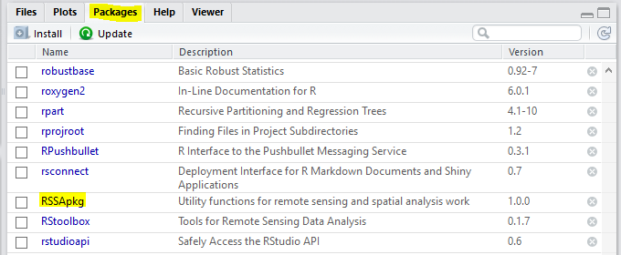
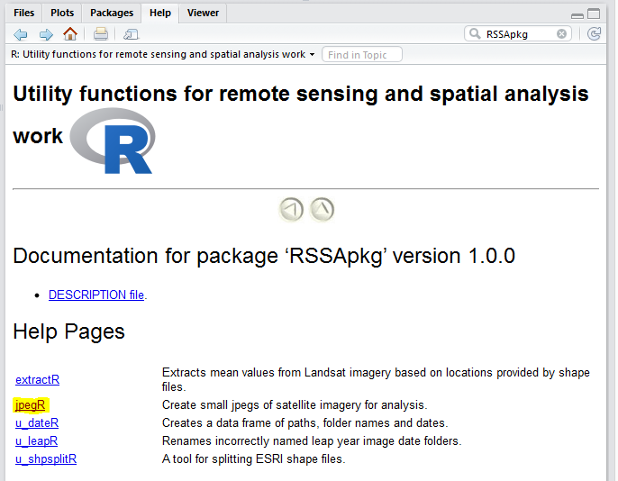
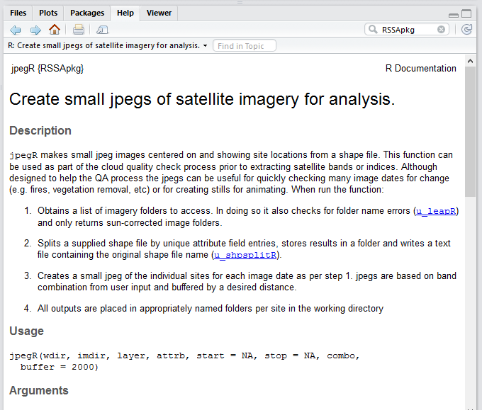

##Time for a change
Having scripts or code that perform elements of processing or analysis is an 
essential step in making our work robust and repeatable. However not having 
control of individual function versions when copied from one work project to the 
next becomes problematic on many levels:

1. Copied and pasted functions can inadvertently introduce errors.
1. Old buggy versions persist when new and improved versions are released.
1. It becomes harder to fix bugs when the internal code of a function has been 
altered beyond its original remit.

So in light of this it's time to release the Remote Sensing and Spatial Analysis 
section's own software package, **RSSApkg**.

##A Package?
This is a great strength of R and enables us to wrap up individual functions 
with associated help files and **"How To"** vignettes in an easily distributable 
and versioned bundle. Think of a package as a **"toolbox"** that contains a whole 
heap of interrelated tools that can be used on a task. Even if you are a casual 
user of R you will have come into contact with packages every time you run a 
`library()` command at the top of a script.

The benefits of our package will be:

1. There is loads of help documentation including:
    + function help files when working in R Studio or R.
    + a package website with help files and workflow vignettes.
1. You will always have access to the most up to date version of bug free 
functions.
1. All commonly used functions are readily accessible without having to remember 
where you last worked with a script and then having to copy it.
1. Processing/analysis scripts (you will still save these for a project so that 
you can repeat it again) will be shorter and easy to read.
1. New functions as they become mature will be added.

##Let me at it!
If you are using R Studio on the server then it is already installed you just 
need to load it.
```{r, eval = FALSE}
library(RSSApkg)
```

If you are working on your own computer then you may need to install it first. 
The package is only available to install from the RSSA's own Git Hub project (yes 
that's right we have our own!) and to download it you need another package to 
help with this.
```{r, eval = FALSE}
#install devtools from CRAN if you don't already have it
install.packages("devtools")

#install and load RSSApkg
devtools::install_github("RSPaW/RSSApkg")
library(RSSApkg)
```

I will always send around an email heads up if the package has been updated and 
let you know what's changed. If you are working on the server then its just nice 
to know. If however you like working on your own computer then it's your cue to
re-install with the method outlined above. 

Easy huh?

##Finding Help
As previously mentioned there is help available for all the functions in the 
package.

####1. From the console or editor
If you know the name of the function you want help with, in the console window 
type `help("function name")`. This will open the help file for that function and
if working in R Studio, will open it in the help pane.

Another great feature in R Studio is that there is an auto-complete so when 
typing out the function name it will try to guess the function name **and** show
what the function arguments are.

####2. Using RStudio's help
Firstly click on the **Packages** tab and scroll down the available packages until
you find the **RSSApkg**.


This has the benefit of showing you all the help files available. Next you click 
on the one you want.


Detailed documentation is then displayed.


####3. From the website
Housing and distributing packages from Git Hub has a nice side benefit and that is
that a package website can easily be created. There are a number of ways to get 
to it. You can click [here](https://rspaw.github.io/RSSApkg/index.html) and 
there is always a link at the bottom of the help files accessed via the two 
methods outlined above. The benefits of the website are:

1. All documentation relating to the package resides in the one readily accessible 
location. This will include:
    + Help files like those explained above located under the **Reference** menu.
    + Package vignettes. These vignettes are like guided **"How To"** 
    documents. Vignettes are written for complicated functions with multiple 
    side effects or detailed workflows involving multiple functions and are found 
    under the **Articles** menu.
1. There is a landing page giving instructions on installation and loading the 
package.
1. There are links to the source code and a place to log bugs or issues. Please 
use the later if you obtain anything other than what you expect when using the 
package.
1. You can see who the developers, authors and maintainers are.
1. You can see the build status (pass/fail) for Windows or Linux/Mac OS.
1. Lastly there will also be a **News** menu that will outline version differences
and additions to the package over time.

